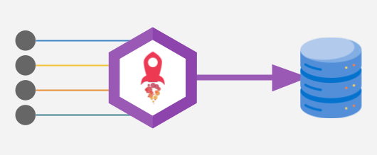

# LuLu Logs

Lulu-Logs est un système de logging conçu pour fusionner des données de test hétérogènes dans une timeline unique et produire des rapports de test interactifs.

Cette spécification définit le format lulu : c'est un format de rapport de tests binaire & streamable basé sur [**FlatBuffers**](https://flatbuffers.dev/).



---

## Table des matières

1. [Schéma d'un LogRecord](#1-schéma-dun-logrecord)
   1.1. [key - règles de nommage et objectif](#11-key---règles-de-nommage-et-objectif)
   1.2. [timestamp](#12-timestamp)
   1.3. [level](#13-level)
   1.4. [type](#14-type)
2. [Data et encodage des données en fonction du type](#2-data-et-encodage-des-données-en-fonction-du-type)
3. [Stream structure (séparation des logs par une taille de trame)](#3-stream-structure-séparation-des-logs-par-une-taille-de-trame)

---

## 1. Schéma d'un LogRecord

### 1.1 key - règles de nommage et objectif

Le champ `key` du LogRecord représente la **key** (clé) du log. Il suit une convention hiérarchique pour identifier la source et l'attribut mesuré.

**Format général :**
```
{source_segment_1}/{source_segment_2}/.../{source_segment_n}/{attribute_name}
```

**Règles de nommage :**
- Les segments sont des chaînes alphanumériques en minuscules
- Séparateur autorisé : tiret `-`
- Aucun segment ne peut être vide
- `{attribute_name}` est un identifiant simple (pas de `/` imbriqué)
- Longueur maximale recommandée : 256 caractères

**Objectif :**
- Identifier de manière unique la source et l'attribut mesuré
- Permettre un routage et un filtrage efficace des logs
- Maintenir une hiérarchie claire et lisible

**Exemples :**
| Key | Description |
|-----|-------------|
| `mcp/filesystem/read-file` | Lecture de fichier |
| `mcp/github/pull-request/status` | Statut d'une PR |
| `psu/power-supply/channel-1/voltage` | Tension canal 1 |
| `sensor/temperature/ambient` | Température ambiante |
| `test/scenario/voltage-regulation-3v3` | Scénario de test |

**Extraction de la source et de l'attribut :**
```
ALGORITHME parse_key
ENTRÉE: key (chaîne de caractères)
SORTIE: (source, attribute)

1. Diviser key par '/' → parts
2. SI length(parts) < 2 ALORS
3.   RETOURNER (key, "")
4. SINON
5.   source ← join(parts[0..length(parts)-1], "/")
6.   attribute ← parts[length(parts)-1]
7.   RETOURNER (source, attribute)
8. FIN SI
```

### 1.2 timestamp

**Type :** `u64` (requis)

**Format :** Nanosecondes depuis l'epoch Unix (1970-01-01T00:00:00Z)
- Exemple : `1772044200123000000` (équivalent à `2026-02-26T14:30:00.123Z`)

**Règles :**
- Toujours en UTC (par définition de l'epoch Unix)
- Précision : nanoseconde (1e-9 seconde)
- Valeur maximale : ~2554 (dépassement de `u64`)

**Objectif :**
- Permettre une synchronisation temporelle précise entre différents systèmes
- Optimiser l'espace (8 octets vs ~24 pour une chaîne ISO 8601) et la performance (pas de parsing)

**Conversion vers ISO 8601 (pour affichage) :**
```
ALGORITHME u64_to_iso8601
ENTRÉE: ns (u64, nanosecondes depuis epoch Unix)
SORTIE: string (ISO 8601 UTC)

1. seconds ← ns ÷ 1_000_000_000
2. nanoseconds ← ns % 1_000_000_000
3. date ← convertir seconds en date UTC
4. RETOURNER date au format "YYYY-MM-DDTHH:MM:SS" + "." + nanoseconds (9 chiffres) + "Z"

EXEMPLE:
u64_to_iso8601(1772044200123000000) → "2026-02-26T14:30:00.123000000Z"
```

### 1.3 level

**Type :** `LogLevel` (enum, valeur par défaut : `Info`)

**Valeurs possibles :**
| Valeur | Identifiant | Sévérité | Description |
|--------|-------------|----------|-------------|
| `0` | `Trace` | Trace | Trace de développement fin-grain |
| `1` | `Debug` | Debug | Information de débogage |
| `2` | `Info` | Info | Événement nominal *(valeur par défaut)* |
| `3` | `Warn` | Warn | Avertissement non-bloquant |
| `4` | `Error` | Error | Erreur récupérable |
| `5` | `Fatal` | Fatal | Erreur critique, arrêt probable |

**Objectif :**
- Indiquer la sévérité de l'événement
- Permettre un filtrage par niveau de criticité

### 1.4 type

**Type :** `DataType` (enum, requis)

**Valeurs possibles :**
| Valeur | Identifiant | Description |
|--------|-------------|-------------|
| `0` | `String` | Chaîne UTF-8 |
| `1` | `Int32` | Entier signé 32 bits |
| `2` | `Int64` | Entier signé 64 bits |
| `3` | `Float32` | Flottant simple précision |
| `4` | `Float64` | Flottant double précision |
| `5` | `Bool` | Booléen (1 octet) |
| `6` | `Json` | Document JSON |
| `7` | `Bytes` | Données binaires opaques |
| `8` | `NetPacket` | Paquet réseau |
| `9` | `SerialChunk` | Fragment de liaison série |
| `1000` | `SpanBeg` | Début de span (JSON) |
| `1001` | `SpanEnd` | Fin de span (JSON) |
| `1002` | `ScenarioBeg` | Début de scénario (JSON) |
| `1003` | `ScenarioEnd` | Fin de scénario (JSON) |
| `1004` | `StepBeg` | Début d'étape (JSON) |
| `1005` | `StepEnd` | Fin d'étape (JSON) |

**Objectif :**
- Définir le format des données dans le champ `data`
- Permettre une interprétation correcte des octets bruts

**Structure FlatBuffers :**
```flatbuffers
table LogRecord {
  key: string (required);         // Chemin hiérarchique
  timestamp_ns: u64 (required);  // Nanosecondes depuis epoch Unix (1970-01-01T00:00:00Z)
  level: LogLevel = Info;        // Niveau de sévérité
  type: DataType (required);     // Type de la donnée
  data: [ubyte] (required);      // Donnée binaire brute
}
```

---

## 2. Data et encodage des données en fonction du type

Le champ `data` est un vecteur d'octets bruts (`[ubyte]`). Son interprétation dépend du champ `type`.

### Encodage par type

#### Types primitifs

**String (0)**
- Encodage : UTF-8
- Exemple : `"Hello, World!"` → octets UTF-8

**Int32 (1)**
- Encodage : little-endian, 4 octets
- Exemple : `42` → `[0x2A, 0x00, 0x00, 0x00]`

**Int64 (2)**
- Encodage : little-endian, 8 octets
- Exemple : `42` → `[0x2A, 0x00, 0x00, 0x00, 0x00, 0x00, 0x00, 0x00]`

**Float32 (3)**
- Encodage : IEEE 754 simple précision, little-endian, 4 octets
- Exemple : `3.14` → `[0xDB, 0x0F, 0x49, 0x40]`

**Float64 (4)**
- Encodage : IEEE 754 double précision, little-endian, 8 octets
- Exemple : `3.14` → `[0x1F, 0x85, 0xEB, 0x51, 0xB8, 0x1E, 0x09, 0x40]`

**Bool (5)**
- Encodage : 1 octet
- `false` → `0x00`
- `true` → `0x01`

**Json (6)**
- Encodage : UTF-8
- Doit être un document JSON valide
- Exemple : `{"key": "value"}` → octets UTF-8

**Bytes (7)**
- Encodage : octets bruts
- Pas d'interprétation définie

**NetPacket (8)**
- Encodage : octets bruts
- Contient un paquet réseau complet

**SerialChunk (9)**
- Encodage : octets bruts
- Contient un fragment de liaison série

### Types spéciaux (spans)

Les types `SpanBeg`, `SpanEnd`, `ScenarioBeg`, `ScenarioEnd`, `StepBeg`, et `StepEnd` utilisent un encodage JSON pour le champ `data`.

**Contrat commun :**
- Le consommateur DOIT corrélér un événement de fin avec son événement de début via le couple `(span_id, key)`
- `span_id` est l'identifiant stable de corrélation
- Un événement `*_end` sans `*_beg` correspondant DOIT être ignoré ou signalé comme anomalie

#### SpanBeg (1000)
**Champ `data` (JSON) :**
```json
{
  "span_id": "string (requis)",
  "name": "string (optionnel)",
  "kind": "string (requis)",
  "metadata": "object (optionnel)"
}
```

#### SpanEnd (1001)
**Champ `data` (JSON) :**
```json
{
  "span_id": "string (requis)",
  "name": "string (optionnel)",
  "kind": "string (requis)",
  "success": "bool (requis)",
  "error": "string (requis si success=false)",
  "duration_ms": "uint64 (optionnel)",
  "metadata": "object (optionnel)",
  "result": "any JSON (optionnel)"
}
```

#### ScenarioBeg (1002) et ScenarioEnd (1003)
- `kind` est implicite et vaut `"scenario"`
- `span_id` reste obligatoire
- `name` contient le nom lisible du scénario

**Exemple ScenarioBeg :**
```json
{
  "span_id": "scenario-voltage-regulation-3v3",
  "name": "voltage-regulation-3v3",
  "metadata": {
    "target_voltage": 3.3,
    "tolerance_v": 0.05
  }
}
```

**Exemple ScenarioEnd (succès) :**
```json
{
  "span_id": "scenario-voltage-regulation-3v3",
  "name": "voltage-regulation-3v3",
  "success": true,
  "duration_ms": 24,
  "result": {
    "measured_min": 3.30,
    "measured_max": 3.31
  }
}
```

#### StepBeg (1004) et StepEnd (1005)
- `kind` est implicite et vaut `"step"`
- `span_id` reste obligatoire
- `name` contient le nom lisible de l'étape

**Exemple StepBeg :**
```json
{
  "span_id": "step-measure-voltage-001",
  "name": "measure-voltage",
  "metadata": {
    "channel": 1,
    "expected_v": 3.3
  }
}
```

**Exemple StepEnd :**
```json
{
  "span_id": "step-measure-voltage-001",
  "name": "measure-voltage",
  "success": true,
  "duration_ms": 5,
  "result": {
    "measured_v": 3.31
  }
}
```

---

## 3. Stream structure (séparation des logs par une taille de trame)

### Format binaire

Chaque `LogRecord` est encodé comme suit dans le flux :

```
+----------------+---------------------+
| u32 (4 octets) | FlatBuffer LogRecord |
| Length (BE)    | (variable size)      |
+----------------+---------------------+
```

- **Length** : Taille du buffer FlatBuffer en octets, encodé en **big-endian** (u32)
- **FlatBuffer** : Le buffer binaire FlatBuffer contenant le LogRecord sérialisé

### Exemple de flux

```
Stream: [00 00 00 2A][FLATBUFFER_DATA_42_bytes][00 00 00 35][FLATBUFFER_DATA_53_bytes]...
        ^^^^^^^^^^^^^  ^^^^^^^^^^^^^^^^^^^^^^  ^^^^^^^^^^^^  ^^^^^^^^^^^^^^^^^^^^^^
        Length=42       LogRecord 1           Length=53       LogRecord 2
```

### Avantages du format streamable

1. **Lecture séquentielle** : Pas besoin de connaître la taille totale du flux
2. **Append-only** : Possibilité d'ajouter des records à la fin sans réécrire
3. **Mémoire efficace** : Lecture record par record sans charger tout en mémoire
4. **Transport générique** : Fonctionne avec n'importe quel protocole byte-oriented
5. **Résistant aux corruptions** : Une corruption n'affecte qu'un seul record

### Algorithme de lecture

```
ALGORITHME read_next_record
ENTRÉE: reader (flux d'octets)
SORTIE: LogRecord ou NULL (fin de flux)

1. Lire 4 octets depuis reader → length_bytes
2. SI EOF ALORS RETOURNER NULL
3. SI erreur ALORS RETOURNER ERREUR
4. length ← convertir length_bytes en u32 big-endian
5. Allouer buffer de taille length
6. Lire length octets depuis reader → buffer
7. SI EOF ou erreur ALORS RETOURNER ERREUR
8. Parser buffer comme FlatBuffer LogRecord → record
9. RETOURNER record
```

### Algorithme d'écriture

```
ALGORITHME write_record
ENTRÉE: writer (flux d'octets), record (LogRecord)

1. Sérialiser record en FlatBuffer → buffer
2. length ← taille de buffer en octets
3. Écrire length (u32 big-endian) vers writer
4. Écrire buffer vers writer
5. RETOURNER succès
```

### Contraintes

| Règle | Description |
|-------|-------------|
| **Key validation** | La key doit contenir au moins **1 segment source + 1 attribut** (minimum 2 segments) |
| **Longueur key** | Longueur maximale recommandée : **256 caractères** |
