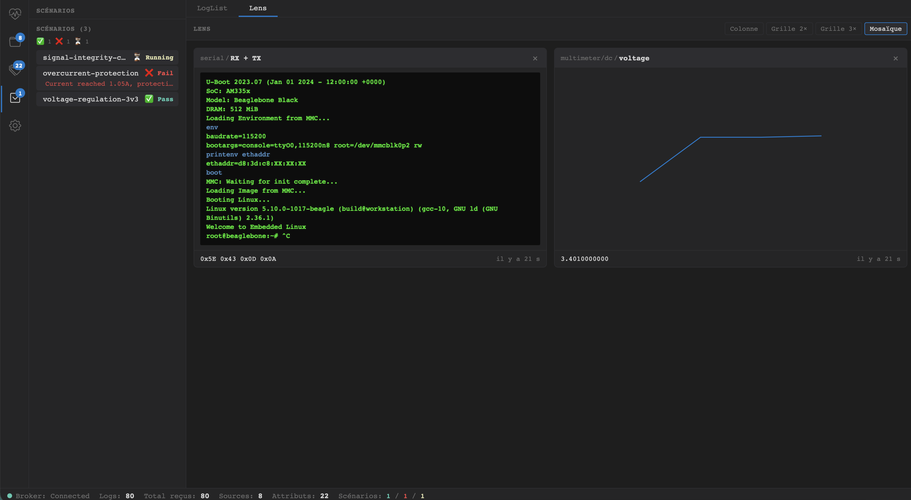

# LULU LOGS

Lulu-Logs is a logging system designed to merge heterogeneous test data into a single timeline and produce interactive test reports.

## Application

The application captures and analyzes logs from your testing sequences in real-time.


Pin some data sources to zoom-in the analysis.



## Rust Client

The Rust client provides a simple singleton API to send logs over MQTT to the Lulu-Logs system.

### Usage

First, initialize the client with your MQTT broker configuration:

```rust
use lulu_logs_client::{lulu_init, lulu_publish, LogLevel, Data, LuluClientConfig};

// Initialize the client
let config = LuluClientConfig {
    broker_host: "127.0.0.1".to_string(),
    broker_port: 1883,
    ..Default::default()
};
lulu_init(config)?;

// Publish a log entry
lulu_publish(
    "device/sensor-1",           // source (hierarchical path)
    "temperature",                // attribute name
    LogLevel::Info,                // log level
    Data::Float(23.5),             // data value
)?;

// Gracefully shutdown when done
lulu_shutdown();
```

### Embedded recorder (CI / offline usage)

When you need to record logs without the Lulu-Logs desktop application (e.g. in a CI pipeline), use the embedded recorder.  It starts a local MQTT broker, captures every `lulu/#` message published by the current process, and saves them to a `.lulu` file that can be opened later in the application for analysis.

```rust
use lulu_logs_client::{lulu_start_recorder, lulu_stop_recorder, lulu_publish, lulu_shutdown, LogLevel, Data};

// Start the recorder — also calls lulu_init internally.
// Pass None to use the default file name "lulu_recording.lulu" in the current directory.
lulu_start_recorder(Some("my_test_run.lulu".into()))?;

// Publish logs as usual
lulu_publish("device/sensor-1", "temperature", LogLevel::Info, Data::Float(23.5))?;

// Stop the recorder: drains the queue, then writes (or appends to) the .lulu file.
lulu_stop_recorder()?;
```

If `my_test_run.lulu` already exists, the new records are **appended** to the existing ones — the file is never overwritten.  This makes it safe to call the recorder across multiple CI runs while keeping a single accumulated log file.

